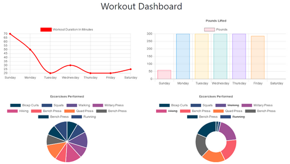

# Fitness_Tracker
A person is more likely to reach their fitness goals if they are able to track and measure their progress. This app allows a user to do just that. You can add your workouts and then display metrics showing your progress over your last 7 workouts.

The front-end code was provided (though I did make a few tweaks). I implemented the mongodb database, and a REST API on the backend for creating, updating, and fetching workout data. MongoDB, Mongoose, Node, and Express were used to implement the backend functionality. The project was deployed to the Heroku hosting platform.

## Usage
The homepage displays a summary of your last workout.

Each workout may consist of multiple exercises. So on the homepage you have the option of adding additional exercises to your last workout by selecting `Continue Workout`, or creating a brand new workout by clicking `New Workout`. Selecting either of these options will bring you to the `Add Your Exercise` page. (The app automatically tracks if you're adding the exercises to your last workout or a new workout).

On the `Add Your Exercise` page, first use the `Exercise Type` drop-down list to select either the `Resistance` or `Cardio` options, then fill in the remaining fields. If you want to continue entering additional exercises, click the `Add Exercise` button. When you've entered your final exercise for a workout, click the `Complete` button. Pressing `Complete` redirects you back to the homepage where you'll again see a summary of your last workout. 

Observe the navigation bar options.

Clicking `Fitness Tracker` loads the homepage. Selecting `Dashboard` loads a new page which tracks your performance over the last 7 workouts.

* The top-left line graph tracks the duration of each workout.
* The bottom-left pie chart shows the duration of each exercise in your last 7 workouts.
* The top-right bar chart tracks the total pounds per workout.
* The bottom-right doughnut chart shows the pounds lifted for each exercise.

## Try It
You can give the app a try [here](https://fitness-tracker-63575.herokuapp.com/).